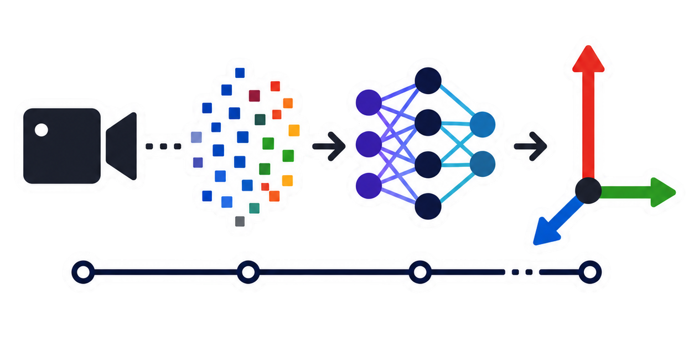

<p align="center">
  
</p>

<h1 align="center">PixelVote6D</h1>

<p align="center">
  From-scratch PVNet reimplementation for 6D object pose estimation.
</p>

<p align="center">
  
</p>

<p align="center">
  Offline inference demo showing pose axes, predicted mask, keypoints, and overlay.
</p>

The project was built mainly as a research and learning exercise to learn and among other things, explore the following topics: 

- PyTorch
- Model creation & training
- Transfer learning
- Dataset creation and synthetic data generation
- Sim-to-Real transfer
- etc...

## Pipeline

```text
image -> PVNet -> mask + vector field -> RANSAC keypoints -> SolvePnP -> 6D pose
```

## Repository Focus

- train a PVNet-style model for object keypoint voting
- run offline inference on image folders
- run realtime inference with a webcam
- generate and use synthetic and self-labeled data

## Quick Start

Install dependencies in your environment:

```bash
pip install -e .
```

Train:

```bash
python scripts/train.py --obj-id 1 --dataset drill drill_hd --epochs 20
```

Offline inference:

```bash
python scripts/infer_folder.py \
  --images dataset/realfootage/drill2/frames/ \
  --calib dataset/realfootage/drill2/calibration/ \
  --checkpoint checkpoints/2026-04-02_14-56-01_obj1_drill_hd+drill_cut+sl_drill2+sl_real/checkpoint.pth \
  --keypoints dataset/drill/models/obj_000001_keypoints.txt \
  --output output/inference.mp4
```

Realtime demo:

```bash
python scripts/realtime_demo.py
```

## Project Layout

- runnable entry points live under `scripts/`
- reusable geometry, model, and dataset code lives under `src/pixelvote6d/`
- datasets, checkpoints, and generated outputs stay local and are ignored by Git

## Further Reading

- [Architecture notes](docs/architecture.md)
- [Training notes](docs/training.md)
- [RANSAC notes](docs/ransac.md)
- [Data notes](docs/data.md)
- [Migration plan](docs/migration-plan.md)

## Status

This is a personal research and showcase project rather than a general-purpose framework.

The main value of the repository is the implementation, experiments, and documentation of the approach.